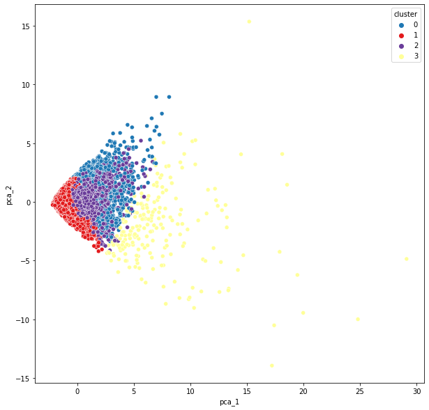

# customer_classification_with_K-Means

## Introducción

- El marketing es fundamental para el crecimiento y la sostenibilidad de cualquier negocio.
- Los especialistas en marketing pueden ayudar a desarrollar la marca de la empresa, atraer clientes, aumentar los ingresos y aumentar las ventas.

    - Growth: Los especialistas en marketing potencian el crecimiento empresarial al llegar a nuevos clientes y clientes.
    - Educación: Los especialistas en marketing educan y comunican la propuesta de valor a los clientes.
    - Drive Sales: Los especialistas en marketing impulsan las ventas y el tráfico a productos/servicios.
    - Engagement: Los especialistas en marketing involucran a los clientes y comprenden sus necesidades.

- Uno de los puntos críticos para los especialistas en marketing es conocer a sus clientes e identificar sus necesidades.
- Al comprender al cliente, los especialistas en marketing pueden lanzar una campaña de marketing dirigida que se adapte a necesidades específicas.
- Si los datos sobre los clientes están disponibles, la ciencia de datos se puede aplicar para realizar la segmentación del mercado.

- En este caso de estudio, te han contratado como consultor de un banco en la ciudad de Nueva York.
- El banco tiene datos extensos sobre sus clientes durante los últimos 6 meses.
- El equipo de marketing del banco desea lanzar una campaña de marketing publicitario dirigida dividiendo a sus clientes en al menos 3 grupos distintos.

## Clasificación

- Usando directamente Kmeans con el análisis WCSS correspondiente (K=8) y PCA para la visualización:

- Usando una reducción de dimemensiones a 10 con AutoEncoders, posteriormente KMeans con el análisis correspondiente (K=4) y PCA para las visualizaciones:

